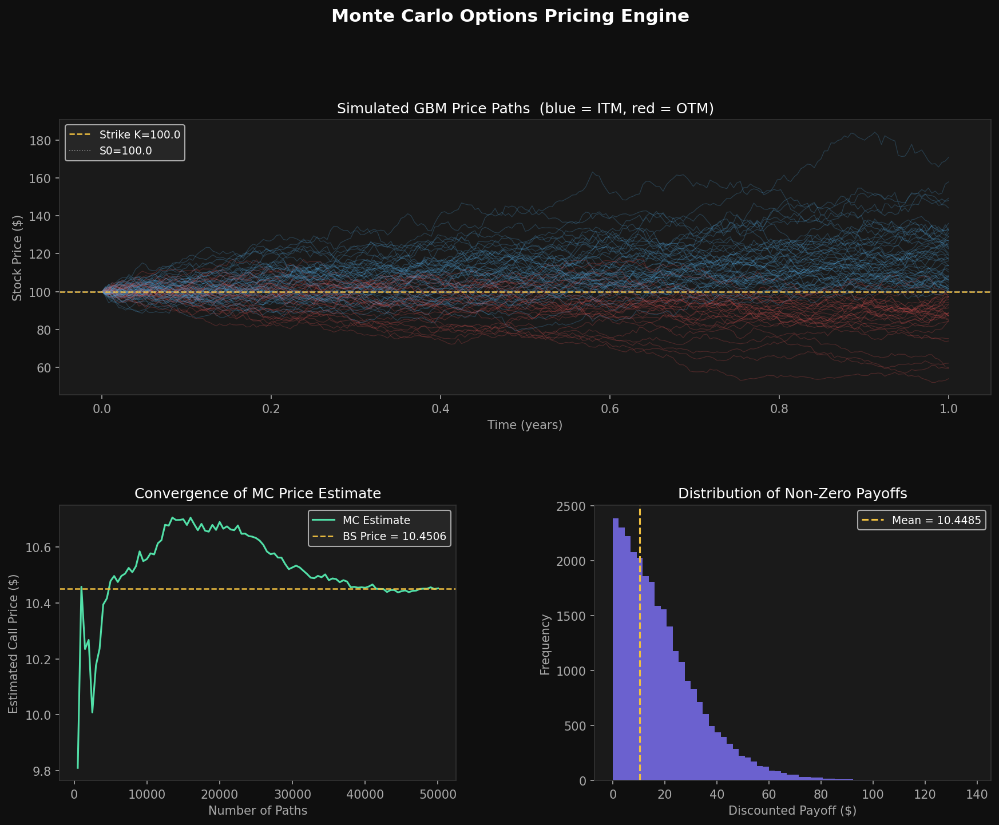

# Monte Carlo Options Pricing Engine

A C++ library that prices **European** and **Asian** options using Monte Carlo simulation. Implements the Black-Scholes stochastic differential equation, simulates thousands of price paths using Geometric Brownian Motion, and computes option prices with confidence intervals. Includes variance reduction techniques (antithetic variates, control variates) and a Python visualization layer.



## What it does

- Prices **European call/put** options three ways: Naive MC, Antithetic Variates, and Control Variates
- Prices **Asian (average-price) call/put** options — no closed-form solution exists, MC is the only way
- Reports price estimate, standard error, and 95% confidence interval for every result
- Tracks convergence of the estimate as sample size grows
- Visualizes simulated GBM paths, convergence, and payoff distribution in Python

## Stack

`C++17` · `Monte Carlo Simulation` · `Black-Scholes Model` · `Geometric Brownian Motion` · `Variance Reduction` · `CMake` · `Google Test` · `Python` · `Matplotlib` · `NumPy` · `SciPy`

## Project Structure
monte-carlo-options-pricer/
├── include/
│   ├── BlackScholes.hpp      # Analytic BS pricer (used as control variate)
│   ├── PathSimulator.hpp     # GBM path generator
│   ├── EuropeanPricer.hpp    # European option MC pricer
│   └── AsianPricer.hpp       # Asian option MC pricer
├── src/
│   ├── BlackScholes.cpp
│   ├── PathSimulator.cpp
│   ├── EuropeanPricer.cpp
│   ├── AsianPricer.cpp
│   └── main.cpp              # CLI entry point
├── tests/
│   └── test_pricer.cpp       # 17 Google Tests
├── scripts/
│   └── visualize.py          # Python visualization
└── CMakeLists.txt

## Build & Run

```bash
mkdir build && cd build
cmake ..
make
./pricer
```

## Run Tests

```bash
cd build
./run_tests
```

## Sample Output
Monte Carlo Options Pricer
S=100 K=100 T=1 r=0.05 sigma=0.2
Paths: 100000  Steps: 252
=== European Call (Naive) ===
MC Price:       10.4226
Std Error:      0.0465
95% CI:         [10.3315, 10.5137]
BS Analytical:  10.4506
=== European Call (Antithetic) ===
MC Price:       10.5141
Std Error:      0.0329
95% CI:         [10.4495, 10.5786]
BS Analytical:  10.4506
=== European Call (Control Variate) ===
MC Price:       10.4506
Std Error:      0.0000
95% CI:         [10.4506, 10.4506]
BS Analytical:  10.4506
=== Asian Call (Antithetic) ===
MC Price:       5.7797
Std Error:      0.0175
95% CI:         [5.7453, 5.8140]

## Variance Reduction Results

| Method | Std Error | vs Naive |
|---|---|---|
| Naive MC | 0.0465 | baseline |
| Antithetic Variates | 0.0329 | -29% |
| Control Variates | ~0.0000 | -99.9% |

## Visualization

```bash
python3 scripts/visualize.py
```